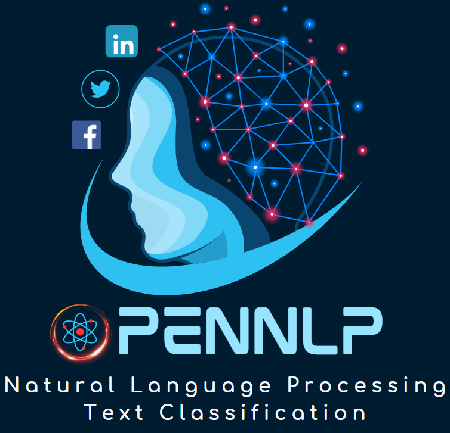

# OpenNLP



OpenNLP is a natural language processing toolkit for classification problems developed by the `Artificial Intelligence and Multiphysics Simulations (AIMS)` group at the University of Michigan. This package provides various types of tools, including classical machine learning models, neural networks, and large language models. In our particular case, we used this tool for sentiment detection, but users can leverage this for any classification problem.

The models include classical machine learning models built using `scikit-learn`, neural network models built using `Keras`, and large language models including BERT, GPT, and Llama2. Further models will continue to be added as the package evolves. OpenNLP supports the following classifiers:

- Bidirectional Encoder Representations from Transformers (BERT),
- Generative Pre-trained Transformer (GPT-2),
- Large Language Model Meta AI (LLaMA-2),
- Feedforward neural networks or Multilayer Perceptron (MLP),
- Long short-term memory (LSTM),
- Convolutional Neural Networks (CNN),
- Decision Trees,
- Random Forests,
- Gradient Boosting,
- Adaboosting,
- Multinomial Naive Bayes,
- Linear Support Vector Machines,

Additional development and support will be provided through this repository. Detailed online documentation is also under development and will be coming soon.

## Citing the Project

This repository is established based on this publication:

```
@article{kwon2024sentiment,
  title={Sentiment analysis of the United States public support of nuclear power on social media using large language models},
  author={Kwon, O Hwang and Vu, Katie and Bhargava, Naman and Radaideh, Mohammed I and Cooper, Jacob and Joynt, Veda and Radaideh, Majdi I},
  journal={Renewable and Sustainable Energy Reviews},
  volume={200},
  pages={114570},
  year={2024},
  publisher={Elsevier}
}
```